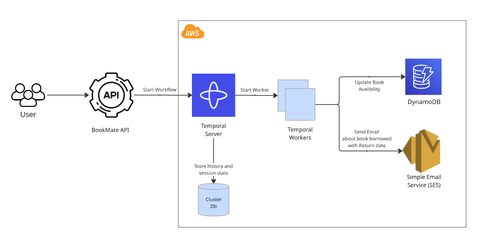

# 📚 BookMate

BookMate is a simple library management system that allows users to borrow books, with email confirmations powered by **AWS SES**, workflows orchestrated by **Temporal**, and book availability managed using **Amazon DynamoDB**.

---

## 🧱 High Level Architecture



---

## 🧱 Project Structure

```
BookMate
│   README.md
└───BookMate.API / # ASP.NET Core API for interacting with users
└───BookMate.Workflows/ # Temporal workflows, Worker and Activities
└───BookMate.SeedData/ # Seeding book data
```

## 🚀 Features

- Borrow books via API
- Send borrow confirmation emails using AWS SES
- Manage book availability with DynamoDB
- Orchestrate workflows with Temporal
- Expose Swagger UI for testing endpoints

---

## ⚙️ Prerequisites

- [.NET 8 SDK](https://dotnet.microsoft.com/en-us/download)
- [Docker](https://www.docker.com/) (for Temporal server)
- [AWS account](https://aws.amazon.com/) with SES and DynamoDB access
- Verified domain in AWS SES
- [Temporal CLI](https://docs.temporal.io/) (optional)

---

# Running the Project

```
docker compose up --build
```

Above docker compose should start the following containers locally:

- Temporal
- Temporal UI
- Temporal MySQL
- BookMate-App

## API Usage

```
http://localhost:5115/swagger
```

## Temporal UI

```
http://localhost:8080/namespaces/default/workflows
```

## Seed Data into your DynamoDB Table

```

dotnet run --project ./BookMate.SeedData

```


