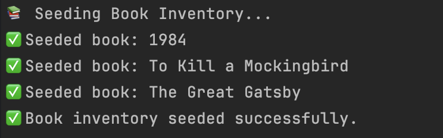

# 📚 BookMate

BookMate is a simple library management system that allows users to borrow books, with email confirmations powered by **AWS SES**, workflows orchestrated by **Temporal**, and book availability managed using **Amazon DynamoDB**.

---

## 🧱 Project Structure

```
BookMate
│   README.md
└───BookMate.API / # ASP.NET Core API for interacting with users
└───BookMate.Workflows/ # Temporal workflows, Worker and Activities
└───BookMate.SeedData/ # Seeding book data
```

## 🚀 Features

- Borrow books via API
- Send borrow confirmation emails using AWS SES
- Manage book availability with DynamoDB
- Orchestrate workflows with Temporal
- Expose Swagger UI for testing endpoints

---

## ⚙️ Prerequisites

- [.NET 8 SDK](https://dotnet.microsoft.com/en-us/download)
- [Docker](https://www.docker.com/) (for Temporal server)
- [AWS account](https://aws.amazon.com/) with SES and DynamoDB access
- Verified domain in AWS SES
- [Temporal CLI](https://docs.temporal.io/) (optional)

---

# Running the Project

## Setup and Start Temporal Server (Local)

https://learn.temporal.io/getting_started/dotnet/dev_environment/

## Using dotnet CLI

```
dotnet run --project ./BookMate.API/ &
dotnet run --project ./BookMate.Worker/
```

## API Usage

http://localhost:5000/swagger

## Seed Data into your DynamoDB Table

```

dotnet run --project ./BookMate.SeedData

```


